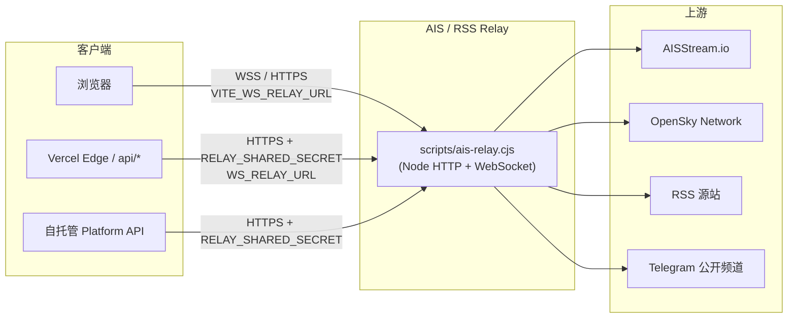

# AIS / RSS Relay 说明

本文说明 World Monitor 自托管中继服务（**AIS / RSS Relay**）的作用、架构、部署方式，以及与主应用的对接关系。

> **说明**：Relay 不是独立的第三方开源产品，而是本仓库内的 Node 服务（`scripts/ais-relay.cjs`）。它聚合转发多种「云 Edge 难以直连」的数据源，管理后台 **数据源配置** 中的 **AIS / RSS Relay** 项即用于配置该服务。

相关文档：

- 环境变量完整列表：[RELAY_PARAMETERS.md](./RELAY_PARAMETERS.md)
- 英文架构说明：[DOCUMENTATION.md](./DOCUMENTATION.md)（Railway Relay Architecture 章节）
- 数据源总览：[数据源说明.md](./数据源说明.md) · 架构：[系统目标与架构.md](./系统目标与架构.md)

---

## 1. 为什么需要 Relay

主应用部署在 Vercel Edge / 自托管 API 上时，会遇到两类限制：

1. **IP 被封**：OpenSky、CNN RSS、UN News、CISA、IAEA 等会拒绝云厂商 IP 段的请求。
2. **协议限制**：AIS 实时数据来自 [AISStream.io](https://aisstream.io) 的 **WebSocket 长连接**，Edge 函数不适合为每个用户维持独立 upstream 连接。

Relay 作为 **第二出口** 运行在有稳定公网 IP 的 Node 进程上（常见为 [Railway](https://railway.app)，也可本地或任意 VPS），负责：

- 维持 **一条** 到 AISStream 的上游 WebSocket，在内存中维护船舶快照并对外提供 HTTP/WebSocket。
- 用 **OAuth / 住宅 IP / User-Agent** 等方式代理 OpenSky、RSS、OREF 等请求。
- 可选：通过 **GramJS** 轮询 Telegram OSINT 公开频道。

Relay 本身 **无状态业务逻辑**（不做新闻解析、不做地图渲染），只做认证、缓存、限流与转发；业务处理仍在 Vercel / 自托管 API / 浏览器侧完成。

---

## 2. 整体架构



**典型 RSS 路径**（双层代理）：

```
feeds.ts → /api/rss-proxy?url=...  (Vercel Edge)
              ├─ 优先：Edge 直连 RSS 源
              └─ 失败或被拒：回退 WS_RELAY_URL/rss?url=...
```

新闻 feed 在 `src/config/feeds.ts` 中统一使用 `/api/rss-proxy`；历史上依赖 Railway 的 feed 仍通过 `railwayRss()` 别名标记，实际由 `rss-proxy` 在直连失败时自动回退到 Relay。

---

## 3. 代码位置

| 路径 | 说明 |
|------|------|
| `scripts/ais-relay.cjs` | Relay 主程序（约 3500 行，单文件） |
| `scripts/package.json` | npm 包 `worldmonitor-railway-relay`，`npm start` 启动 relay |
| `scripts/telegram/session-auth.mjs` | 生成本地 Telegram `TELEGRAM_SESSION` |
| `scripts/ais-relay-rss.test.cjs` | RSS 代理缓存回归测试 |
| `api/rss-proxy.js` | Vercel Edge RSS 代理（含 Relay 回退） |
| `api/ais-snapshot.js`、`api/opensky.js` 等 | 其它经 Relay 转发的 Edge 路由 |
| `server/worldmonitor/maritime/v1/get-vessel-snapshot.ts` | 服务端拉取 `/ais/snapshot` |
| `server/platform/integration-provider-catalog.ts` | 管理后台「AIS / RSS Relay」种子与默认备注 |

**依赖的开源库**（Relay 实现所用，非 Relay 产品本身）：

- [`ws`](https://github.com/websockets/ws) — WebSocket 服务端/客户端
- [`telegram`](https://github.com/gram-js/gramjs)（GramJS）— Telegram MTProto 客户端

**上游数据服务**（需自行注册密钥）：

- [AISStream.io](https://aisstream.io) — AIS 船舶位置（免费 key）
- [OpenSky Network](https://opensky-network.org) — 军用/民航 ADS-B（OAuth 客户端可选）

---

## 4. HTTP 路由一览

除 `/health`、`/` 外，生产环境建议启用 `RELAY_SHARED_SECRET`；请求需携带 `x-relay-key`（或 `RELAY_AUTH_HEADER` 指定头）或 `Authorization: Bearer <secret>`。

| 路由 | 用途 | 备注 |
|------|------|------|
| `GET /health`、`GET /` | 健康检查 | 公开；返回 AIS/Telegram/OREF 状态与缓存规模 |
| `GET /metrics` | 运行指标 | 需鉴权 |
| `WebSocket /` | AIS 实时流 | 需 `AISSTREAM_API_KEY`；客户端上限默认 10 |
| `GET /ais/snapshot` | 船舶快照 JSON | 服务端轮询常用；支持 `?candidates=true` |
| `GET /opensky` | OpenSky 代理 | 建议配置 OAuth Client |
| `GET /rss?url=` | RSS 代理 | **域名白名单**；见下文 |
| `GET /telegram`、`/telegram/*` | Telegram OSINT 条目 | 需 `TELEGRAM_*` |
| `GET /oref/alerts`、`/oref/history` | 以色列 OREF 警报 | 需 `OREF_PROXY_AUTH` |
| `GET /polymarket` | Polymarket Gamma API 代理 | 队列与缓存防 stampedes |
| `GET /notam` | ICAO NOTAM | 部分区域 IP 限制 |
| `GET /worldbank`、`/ucdp-events` 等 | 其它易被云 IP 拦截的 API | 按需启用 |

响应大于约 1KB 且客户端接受 `gzip` 时会自动压缩，降低 egress。

---

## 5. AIS 数据流

```
AISStream (wss://stream.aisstream.io/v0/stream)
    → Relay 上游单连接 + 内存队列（可配置 HIGH/LOW WATER）
    → 内存船舶表（默认最多约 2 万艘）+ 定时 snapshot
    → 客户端：WebSocket / 或 HTTP GET /ais/snapshot
```

**环境变量（Relay 侧）**

| 变量 | 必填 | 说明 |
|------|------|------|
| `AISSTREAM_API_KEY` | 是 | 在 [aisstream.io](https://aisstream.io) 申请 |

**环境变量（应用侧）**

| 变量 | 说明 |
|------|------|
| `WS_RELAY_URL` | 服务端访问 Relay 的 HTTPS 基址（如 `https://xxx.up.railway.app`） |
| `VITE_WS_RELAY_URL` | 本地开发时浏览器直连 Relay（可选） |
| `RELAY_SHARED_SECRET` | 与 Relay 一致的共享密钥 |
| `RELAY_AUTH_HEADER` | 默认 `x-relay-key` |

Web 自托管需显式配置 `WS_RELAY_URL` / `VITE_WS_RELAY_URL`。详见 [RELAY_PARAMETERS.md](./RELAY_PARAMETERS.md)。

---

## 6. RSS 代理

### 6.1 两层代理策略

1. **第一层 — `api/rss-proxy.js`（Vercel Edge / 自托管等价路由）**
   - 维护较大 **域名白名单**（BBC、Guardian、Google News、各政府站点等）。
   - 使用浏览器 User-Agent 直连；超时后尝试 Relay。

2. **第二层 — Relay `/rss`**
   - 仅代理 **仍被云 IP 拦截** 的域名（白名单较小，与 `feeds.ts` 中 `railwayRss()` 用法对齐）。
   - 成功响应缓存约 **5 分钟**；失败缓存约 **1 分钟**。
   - 禁止 `rsshub.app` 等已废弃域名（返回 410）。

### 6.2 Relay RSS 白名单（节选）

完整列表以 `scripts/ais-relay.cjs` 内 `allowedDomains` 为准，主要包括：

- 国际组织：`news.un.org`、`www.cisa.gov`、`www.iaea.org`、`www.who.int` …
- 媒体：`rss.cnn.com`、`www.scmp.com`、`kyivindependent.com` …
- 其它：`www.atlanticcouncil.org`、`layoffs.fyi` …

新增 feed 时：若 Edge 直连失败，需同时在 **Relay 白名单** 与 **`api/rss-proxy.js` 的 `ALLOWED_DOMAINS`** 中评估是否加入。

### 6.3 测试 RSS 代理

```bash
# Relay 本地（默认端口 3004）
curl -sS "http://127.0.0.1:3004/rss?url=https://news.un.org/feed/subscribe/en/news/all/rss.xml" \
  -H "x-relay-key: YOUR_RELAY_SHARED_SECRET" | head

# 回归测试
node --test scripts/ais-relay-rss.test.cjs
```

---

## 7. 可选能力：Telegram OSINT

Relay 可轮询配置的 Telegram **公开频道**，供 Early Signals 等模块使用。

| 变量 | 说明 |
|------|------|
| `TELEGRAM_API_ID`、`TELEGRAM_API_HASH` | [my.telegram.org/apps](https://my.telegram.org/apps) |
| `TELEGRAM_SESSION` | GramJS StringSession |
| `TELEGRAM_CHANNEL_SET` | 频道集合，默认 `full` |

**生成本地 Session**（仅在本机执行，勿提交仓库）：

```bash
cd scripts
npm install
TELEGRAM_API_ID=... TELEGRAM_API_HASH=... node telegram/session-auth.mjs
# 将输出的 TELEGRAM_SESSION=... 配置到 Relay 环境变量
```

---

## 8. 部署指南

### 8.1 本地开发

```bash
cd scripts
npm install

# 最小可运行（AIS + 鉴权）
export AISSTREAM_API_KEY=ais_xxxxxxxx
export RELAY_SHARED_SECRET=your_local_secret
export ALLOW_UNAUTHENTICATED_RELAY=false   # 生产必须为 false
node ais-relay.cjs
# 默认监听 PORT=3004
```

主应用 `.env.local` 示例：

```bash
WS_RELAY_URL=http://127.0.0.1:3004
VITE_WS_RELAY_URL=ws://127.0.0.1:3004
RELAY_SHARED_SECRET=your_local_secret
RELAY_AUTH_HEADER=x-relay-key
AISSTREAM_API_KEY=ais_xxxxxxxx
```

启动主应用：

```bash
npm run platform:api   # 自托管 API :8787
npm run dev            # 前端 :3000，/admin 管理后台
```

### 8.2 Railway（推荐生产）

1. 新建 Railway 项目，Root Directory 指向 **`scripts/`**（或部署整个仓库并设置 Start Command 为 `node ais-relay.cjs`）。
2. 配置环境变量（至少）：
   - `AISSTREAM_API_KEY`
   - `RELAY_SHARED_SECRET`（强随机字符串）
   - `RELAY_AUTH_HEADER=x-relay-key`（可选，与主应用一致）
   - 按需：`OPENSKY_CLIENT_ID`、`OPENSKY_CLIENT_SECRET`、`TELEGRAM_*`、`OREF_PROXY_AUTH`
3. 部署后获得公网 URL，例如 `https://your-app.up.railway.app`。
4. 在主应用（Vercel / 自托管）设置：
   - `WS_RELAY_URL=https://your-app.up.railway.app`
   - `RELAY_SHARED_SECRET`（与 Railway **完全相同**）

Railway 会自动注入 `RAILWAY_*` 变量；Relay 据此识别生产环境并 **强制要求** `RELAY_SHARED_SECRET`（除非显式设置 `ALLOW_UNAUTHENTICATED_RELAY=true`，不推荐）。

### 8.3 Docker / VPS

仓库未附带专用 Dockerfile；可在任意 Node ≥ 18 环境：

```bash
cd scripts && npm ci --omit=dev
AISSTREAM_API_KEY=... RELAY_SHARED_SECRET=... node ais-relay.cjs
```

建议配合 systemd、Docker Compose 或进程管理器，并配置 HTTPS 反向代理（Caddy / Nginx）。对外 URL 填入 `WS_RELAY_URL`。

---

## 9. 与主应用 / 管理后台对接

### 9.1 环境变量（当前）

Relay 相关配置 **尚未完全迁入数据库**，仍以环境变量为主（见 `.env.example` 中 `Railway Relay` 区块）。计划中的 Phase 3 会将部分项收敛到 **数据源配置**。

| 配置项 | 环境变量 | 管理后台字段 |
|--------|----------|--------------|
| Relay 基址 | `WS_RELAY_URL` | AIS / RSS Relay → Base URL |
| 共享密钥 | `RELAY_SHARED_SECRET` | AIS / RSS Relay → API Key |
| AIS 上游密钥 | `AISSTREAM_API_KEY` | 单独配置在 Relay 进程环境（非 DB） |
| 浏览器直连（开发） | `VITE_WS_RELAY_URL` | 通常仅本地 |

管理后台默认备注：

> 自托管 WebSocket 中继（本地 Docker 或 Railway）。AIS、OpenSky、RSS、Telegram 等聚合转发，非单一商业 API。

### 9.2 功能开关

`src/services/runtime-config.ts` 中：

- `aisRelay` — 依赖 `WS_RELAY_URL` + `AISSTREAM_API_KEY`（Web）
- `openskyRelay` — 依赖 OpenSky Relay URL 与 OAuth

缺失时对应地图图层 / 面板降级或无数据，不会导致整站不可用。

---

## 10. 验证与排错

### 10.1 健康检查

```bash
curl -sS https://<relay-host>/health | jq .
```

关注字段：

- `connected: true` — AIS 上游 WebSocket 已连接
- `vessels` — 内存船舶数量（靠岸区域应 > 0）
- `auth.sharedSecretEnabled: true` — 生产已启用鉴权
- `telegram.enabled` / `oref.enabled` — 可选模块是否生效

### 10.2 指标

```bash
curl -sS https://<relay-host>/metrics \
  -H "x-relay-key: $RELAY_SHARED_SECRET"
```

正常负载下 `ais.dropsPerSec` 应为 0，队列深度低于 `AIS_UPSTREAM_QUEUE_HARD_CAP`。调参见 [RELAY_PARAMETERS.md](./RELAY_PARAMETERS.md)。

### 10.3 常见问题

| 现象 | 可能原因 | 处理 |
|------|----------|------|
| Relay 启动即退出 | 未设置 `AISSTREAM_API_KEY` | 在 Relay 环境配置 key |
| 生产启动报 `RELAY_SHARED_SECRET is required` | Railway 未配密钥 | 设置密钥并同步到 `WS_RELAY_URL` 消费方 |
| 船舶图层无数据 | `WS_RELAY_URL` 错误或 secret 不匹配 | 检查 `/health` 与请求头 |
| 某 RSS 403 on Relay | 域名不在 Relay 白名单 | 改 Edge 直连或扩展 `allowedDomains` |
| OpenSky 403 | 未配 OAuth 或 Relay 未部署 | 配置 `OPENSKY_CLIENT_*` |
| Telegram 无数据 | Session 无效或 FLOOD_WAIT | 重新 `session-auth.mjs` |

---

## 11. 安全建议

1. **生产必须** 设置 `RELAY_SHARED_SECRET`，并保持 Railway 与主应用 **完全一致**。
2. 不要将 `RELAY_SHARED_SECRET`、`TELEGRAM_SESSION` 提交到 Git；使用平台 Secret 管理。
3. 保持 `ALLOW_UNAUTHENTICATED_RELAY=false`。
4. RSS 使用 **双端白名单**，避免 Relay 成为开放代理。
5. Relay 暴露公网时建议仅通过 HTTPS 访问（Railway 默认提供 TLS）。

---

## 12. 与 RSSHub 等项目的区别

| | AIS / RSS Relay | RSSHub 等 |
|--|-----------------|-----------|
| 定位 | 为本项目定制的 **多协议聚合代理** | 通用 RSS 生成/聚合框架 |
| AIS / OpenSky / Telegram | 内置 | 不支持 |
| 部署 | `scripts/ais-relay.cjs` 单进程 | 独立 RSSHub 服务 |
| 白名单 | 严格域名限制 | 视部署配置而定 |

本项目 **不依赖** RSSHub；历史 feed 若指向 `rsshub.app` 已在 Relay 层返回 410 废弃。

---

## 13. 延伸阅读

- [RELAY_PARAMETERS.md](./RELAY_PARAMETERS.md) — 全部环境变量与推荐调优值
- [数据源说明.md](./数据源说明.md) — 数据源总览（含 relay）
- [系统目标与架构.md](./系统目标与架构.md) — 系统架构
- [文档说明清单.md](./文档说明清单.md) — 全库文档索引
