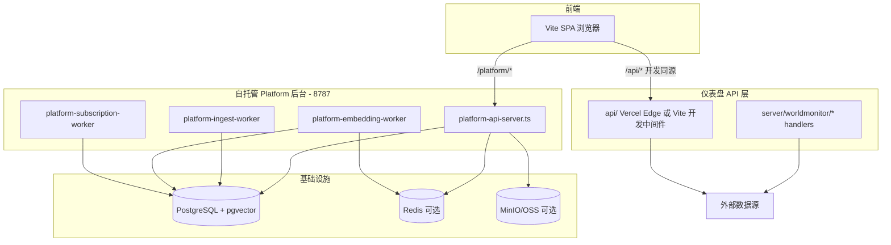
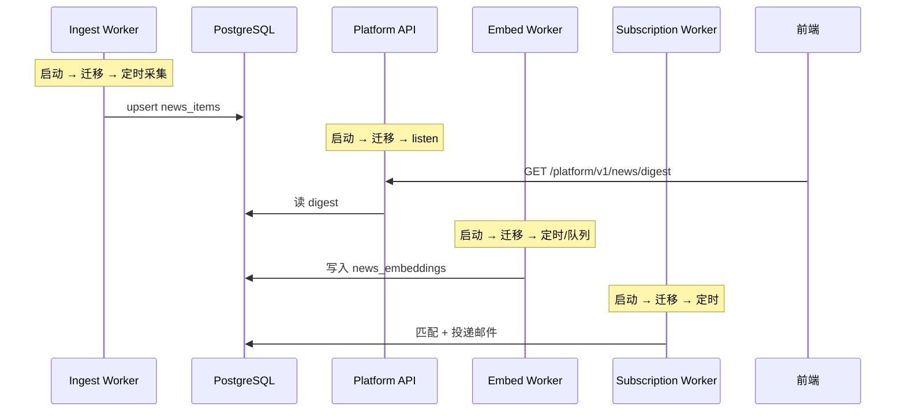
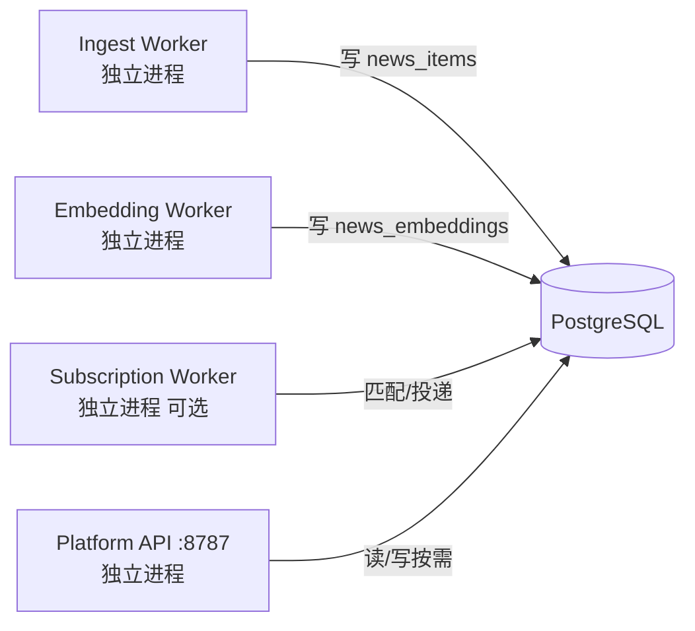

# Platform 后台启动与运行设计

> **总览与现行架构：** [系统目标与架构.md](./系统目标与架构.md)（进程名以 `apps/platform-*` 为准）。  
> 本文保留启动步骤与运维细节；若与 Monorepo 拆分后的路径冲突，以 `apps/` + 根 `package.json` 的 `platform:*` 为准。  
> 相关：[deploy/README.md](../deploy/README.md) · [功能清单.md](./功能清单.md) · [文档说明清单.md](./文档说明清单.md)

---

## 一、后台整体架构

World Monitor 的后端不是单一进程，而是**多进程 + 按需请求**的设计：



| 组件 | 入口 | 端口/方式 | 职责 |
|------|------|-----------|------|
| **Platform API** | `apps/platform-api`（`npm run platform:api`） | `:8787` | REST 聚合、管理后台、用户认证、HXXBOT 工具 |
| **Ingest Worker** | `apps/platform-ingest*` 或 Job | 无 HTTP | 定时 RSS 采集入库 |
| **Embedding Worker** | `apps/platform-embed` 或 Job | 无 HTTP | 新闻向量化（语义检索） |
| **Subscription** | Job `subscription-match-deliver`（推荐） | 无 HTTP | 订阅匹配 + 邮件投递 |
| **Vercel / Vite `/api/*`** | `api/*.js` + `server/worldmonitor/*` | 云端 Edge 或开发态 Vite | 仪表盘实时代理与 sebuf |

日常开发自托管后台时，典型是：**1 个 API 进程 + 1 个 Ingest 进程 + PostgreSQL**（Embedding / Subscription 按需启动）。

---

## 二、所有 Platform 进程共用的启动流程

每个 `platform:*` 脚本启动时都会走同一套「引导（bootstrap）」逻辑：

### 1. 加载环境变量

`scripts/platform-api-server.ts` 等入口首先调用 `loadEnvLocal()`，从项目根目录读取 `.env.local`，**不覆盖**已有环境变量。`DATABASE_URL`、`PLATFORM_API_PORT` 等都在这里注入。

实现：`server/_shared/load-env.ts`

### 2. 初始化日志

- 创建 `createPlatformLogger('platform-api' | 'platform-ingest' | …)`
- 日志写到 `logs/{service}/{date}.log`（可通过 `PLATFORM_LOG_DIR` 改）
- `installProcessLogHandlers` 注册 `uncaughtException` / `unhandledRejection` 全局处理器

实现：`server/_shared/platform-logger.ts`

### 3. 数据库自动迁移（核心启动步骤）

只要配置了 `DATABASE_URL`，且 `PLATFORM_DB_AUTO_MIGRATE` 不为 `false`，就会执行 `ensurePlatformDatabaseReady()`。

`ensurePlatformDatabaseReady` 会：

1. 连接 PostgreSQL
2. 确保 `schema_migrations` 表存在
3. 按顺序检查 `deploy/init/001~021_*.sql`（共 21 个迁移）
4. 对比 checksum，**只应用尚未执行或已变更的 SQL**
5. pgvector 相关迁移（002）若扩展不存在会**跳过**，不影响 Phase 1
6. 执行种子数据：`runPlatformSeedBootstrap` → 插入 integration provider 默认行
7. 失败则 `process.exit(1)`，API 不会 listen

实现：

- `server/platform/platform-db-startup.ts`
- `server/platform/platform-db-bootstrap.ts`
- `server/platform/platform-seed-bootstrap.ts`

关闭自动迁移：`.env.local` 设置 `PLATFORM_DB_AUTO_MIGRATE=false`

### 4. 加载 HXXBOT 配置缓存（API / Subscription）

从 DB 表 `integration_providers` 读取 HXXBOT 的 Base URL 和 API Key，缓存在内存，供翻译、QA、邮件、简报等接口使用。

实现：`server/_shared/hxxbot-config.ts` → `refreshHxxbotConfigCache()`

### 5. 各进程各自的「真正启动」

| 进程 | 迁移后做什么 |
|------|-------------|
| **platform:api** | `server.listen(8787)`，注册 SIGINT/SIGTERM 优雅关闭（关连接池、Redis） |
| **platform:ingest** | 立即跑一轮 RSS 采集；非 `--once` 则每 10 分钟循环 |
| **platform:embed** | 进入 loop：读 Redis 队列或定时跑 embedding batch |
| **platform:subscription** | 进入 loop：匹配订阅规则 → 发邮件 |

---

## 三、各后台进程启动后具体做什么

### 1. Platform API（`npm run platform:api`）

**启动时（一次性）：**

```
loadEnvLocal → 创建 logger → 安装异常处理器
    → DB 自动迁移 + seed
    → refreshHxxbotConfigCache
    → HTTP listen :8787
```

**运行时（每个请求）：**

请求路由按优先级分发：

1. `user-auth-api.ts` — 用户注册/登录/会话
2. `open-api-routes.ts` — 对外开放 API（API Key 鉴权）
3. `admin-api.ts` — 管理后台 `/admin/*`：用户、订阅、数据源配置、日志查看
4. 内联路由 — `/platform/v1/health`、新闻 digest、简报、HXXBOT 工具、研究/向量检索等

API 是**纯请求驱动**的：除了 listen 和迁移，**没有内置定时任务**。手动采集、冷归档等通过 POST 端点触发。

健康检查：`GET /platform/v1/health` 会并行检查 DB、OSS、统计新闻/向量数量。

### 2. Ingest Worker（`npm run platform:ingest`）

**启动时：**

```
loadEnvLocal → logger → DB 迁移
    → 立即执行 tick()（第一轮采集）
    → setInterval(600_000)  // 默认 10 分钟
```

**每轮 tick 做什么：**

对每个 `(variant, lang)` 组合（默认 `full,tech,finance` × `en,zh`）：

1. 从 `VARIANT_FEEDS` 收集 RSS 源（full 还含 INTEL_SOURCES）
2. 并发 20 路拉取 RSS（总 deadline 25 秒）
3. `upsertNewsItems` 写入 PostgreSQL
4. `recordIngestRun` 记录采集统计

实现：`server/platform/rss-ingest.ts`

这是**数据入库的主管道**，前端新闻 digest 读 PG 的前提。

### 3. Embedding Worker（`npm run platform:embed`）

**启动时：** DB 迁移 → 进入无限 loop

**每轮：**

1. 若 Redis 可用：从队列 `readEmbeddingJobs` 消费任务
2. 否则：直接 `runEmbeddingBatch()` 处理未向量化的新闻
3. 默认每 5 分钟休眠（`PLATFORM_EMBED_INTERVAL_MS`）

依赖 pgvector 扩展和 `news_embeddings` 表，属于 Phase 2 语义检索能力。

### 4. Subscription Worker（`npm run platform:subscription`）

**启动时：** DB 迁移 → refreshHxxbotConfigCache → loop（默认 1 小时）

**每轮 `runOnce`：**

1. `runMatchPassAll()` — 按订阅规则匹配新新闻
2. 若 HXXBOT 已配置 → `deliverAllEnabledSubscriptions()` 发邮件
3. 记录 sent / skipped / error

支持 `--once`、`--match-only`、`--deliver-only` 调试模式。

---

## 四、运行设计要点

### 1. 多进程分工，而非单体



- **API 不负责定时采集**，采集由 Ingest 或 `POST /platform/v1/ingest/run` 触发
- **DB 迁移在每个进程启动时幂等执行**，任意进程先启动都能建表
- **连接池懒加载**：`getPool()` 首次查询时才创建（`server/_shared/db.ts`）

### 2. 数据流

```
RSS 源 → Ingest Worker → news_items (PG)
                              ↓
                    Platform API digest 端点
                              ↓
                         前端新闻面板

news_items → Embedding Worker → news_embeddings (pgvector)
                              ↓
                    语义搜索 / 研究监控 API

news_items → Subscription Worker → 匹配 → HXXBOT 邮件
```

前端配置 `VITE_PLATFORM_API_URL=http://localhost:8787` 时，digest **优先走 Platform API**；失败则回退 Vite 的 `/api` 代理。

### 3. 基础设施依赖

| 组件 | Phase 1 必须？ | 用途 |
|------|----------------|------|
| PostgreSQL | **是** | 新闻、用户、订阅、配置 |
| pgvector | 否 | 语义检索（Phase 2） |
| Redis | 否 | Embedding 任务队列 |
| OSS/MinIO | 否 | 冷数据归档 |

Docker Compose（`deploy/docker-compose.yml`）提供 PG + Redis + MinIO，但开发也可只用本机 PostgreSQL。

### 4. 与原 API 层的关系

- **`server/worldmonitor/*`**：TypeScript 业务 handler（RSS 解析、冲突数据等），由 Vite sebuf 插件在开发态加载
- **`api/*.js`**：Vercel 无服务器函数，云端部署用
- **Platform 层**：自托管「数据平台」，把新闻持久化到 PG，并扩展订阅、简报、管理后台

两套 API **并行存在**，Platform 是增量改造，不是替换全部 `/api`。

---

## 五、推荐启动顺序（开发）

```powershell
# 1. 配置 .env.local（DATABASE_URL 等）
# 2. 首次采集
npm run platform:ingest:once

# 3. 终端 A — API
npm run platform:api

# 4. 终端 B — 可选定时采集
npm run platform:ingest

# 5. 终端 C — 前端
npm run dev
```

验证：`http://localhost:8787/platform/v1/health` 应返回 `"database": { "ok": true }` 且 `newsItems > 0`。

---

## 六、Platform API 端点速查

| 方法 | 路径 | 说明 |
|------|------|------|
| GET | `/platform/v1/health` | DB / OSS 状态、新闻条数 |
| GET | `/platform/v1/news/digest?variant=full&lang=en` | 新闻 digest（前端优先） |
| GET | `/platform/v1/news?variant=full&lang=en&limit=50` | 最近新闻列表 |
| GET | `/platform/v1/aggregate/by-category?variant=full&lang=en` | 分类聚合 |
| POST | `/platform/v1/ingest/run` | 手动触发 RSS 入库 |
| POST | `/platform/v1/cold-tier/run` | 冷数据归档（需配置 OSS） |
| POST | `/platform/v1/embedding/run` | 手动/队列触发向量化 |
| POST | `/platform/v1/briefs/generate` | AI 简报生成 |
| GET | `/platform/v1/briefs/latest` | 最新简报 |

管理后台与用户/Open API 路由见 `server/platform/admin-api.ts`、`user-auth-api.ts`、`open-api-routes.ts`。

---

## 七、npm 脚本速查

| 脚本 | 说明 |
|------|------|
| `npm run platform:db:init` | 手动执行 DB 迁移（与启动时自动迁移逻辑相同） |
| `npm run platform:db:migrate` | 同上，CI/调试用 |
| `npm run platform:up` | Docker 启动 PG / Redis / MinIO |
| `npm run platform:down` | Docker 停止 |
| `npm run platform:api` | Platform REST 服务 (:8787) |
| `npm run platform:ingest:once` | 执行一轮 RSS 采集 |
| `npm run platform:ingest` | 定时采集（默认 10 分钟） |
| `npm run platform:embed` | 向量化 Worker |
| `npm run platform:subscription` | 订阅匹配与邮件 Worker |
| `npm run platform:scheduler` | Job 调度 Worker（cron/interval → job_runs） |
| `npm run platform:executor` | Job 执行 Worker（claim pending runs） |

详见 [Platform消费生产端拆分设计.md](./Platform消费生产端拆分设计.md)。

---

## 八、小结

| 问题 | 答案 |
|------|------|
| 启动后立刻做什么？ | 读 `.env.local` → 日志 → **DB 自动迁移** → HXXBOT 缓存 → 各进程进入 listen/loop |
| 有没有统一入口？ | 没有单体；**4 个独立 Node 进程**，共享迁移逻辑 |
| API 会不会自动采新闻？ | **不会**；需 Ingest Worker 或手动 POST |
| 设计思路？ | **采集与 serving 分离**、**迁移幂等**、**PG 为中心**、**Worker 异步处理**向量与订阅 |
| Worker 会阻塞 API 吗？ | **进程级不会**；共享 PG 可能间接变慢；`POST .../ingest/run` 等会在 API 进程内阻塞该请求（见 §十） |

---

## 九、关键源码索引

| 模块 | 路径 |
|------|------|
| **消费/生产拆分设计（总纲）** | [Platform消费生产端拆分设计.md](./Platform消费生产端拆分设计.md) |
| Platform API 入口 | `scripts/platform-api-server.ts` |
| Ingest Worker | `scripts/platform-ingest-worker.ts` |
| Embedding Worker | `scripts/platform-embedding-worker.ts` |
| Subscription Worker | `scripts/platform-subscription-worker.ts` |
| DB 启动迁移 | `server/platform/platform-db-startup.ts` |
| DB 迁移实现 | `server/platform/platform-db-bootstrap.ts` |
| RSS 采集 | `server/platform/rss-ingest.ts` |
| 连接池 | `server/_shared/db.ts` |
| 环境变量加载 | `server/_shared/load-env.ts` |
| SQL 迁移文件 | `deploy/init/*.sql` |
| Docker 编排 | `deploy/docker-compose.yml` |

---

## 十、进程隔离与阻塞关系

### 10.1 可以这样理解

Platform 后台在**全部启动**时，核心是 **1 个 API 服务进程 + 最多 3 个 Worker 进程**（Ingest / Embedding / Subscription），彼此是**不同的 Node 进程**：



| 组件 | 启动命令 | 进程关系 |
|------|----------|----------|
| **Platform API** | `npm run platform:api` | 独立进程，监听 :8787 |
| **Ingest Worker** | `npm run platform:ingest` | 独立进程，无 HTTP |
| **Embedding Worker** | `npm run platform:embed` | 独立进程，无 HTTP（**按需启动**） |
| **Subscription Worker** | `npm run platform:subscription` | 独立进程，无 HTTP（**按需启动**） |

**结论：** Ingest、Embedding 在各自进程里跑定时循环，**不会占用 API 进程的 CPU 或 event loop**，也不会因为 worker 在跑就把 API 进程「卡死」。

只执行 `npm run platform:api` 时，**不会自动拉起任何 Worker**（Worker 数为 0）。

### 10.2 共享 PostgreSQL — 可能变慢，但不是进程阻塞

三个（或四个）进程都连接**同一个 PostgreSQL**：

- Ingest 大批量 `upsert news_items` 时，API 的 `GET /platform/v1/news/digest` 等读请求可能**变慢**（锁、磁盘 IO、连接池竞争）
- Embedding 写 `news_embeddings` 时同理
- 每个进程各自维护连接池（默认 `DATABASE_POOL_MAX=10`），极端情况下可能等待空闲连接

这是**资源竞争导致的延迟**，不是 Ingest/Embedding 进程直接阻塞 API 进程。

### 10.3 会阻塞「某条 API 请求」的情况

以下路径在 **API 进程内同步 `await` 执行**，该 HTTP 请求会挂到任务结束（通常数十秒）：

| 端点 | 行为 |
|------|------|
| `POST /platform/v1/ingest/run` | 在 API 进程内直接跑 `runRssIngest` / `runAllVariantIngest` |
| `POST /platform/v1/embedding/run` | 未走 Redis 队列时，在 API 进程内跑 `runEmbeddingBatch` |
| `POST /platform/v1/cold-tier/run` | 在 API 进程内跑冷归档 |

此时：**其它并发 API 请求一般仍可处理**（Node 异步 I/O），但该请求所在连接会长时间占用，且 API 进程 CPU/内存负载会升高。

若 Embedding 使用 `POST /platform/v1/embedding/run` 且 body 含 `"queue": true` 且 Redis 可用，API 只入队并返回 `202`，不会长时间占住该请求。

**常驻 Worker 的设计目的**，正是把采集、向量化、订阅投递从 API 进程里拆出去，避免拖慢对外 serving。

### 10.4 API 请求「在等什么」

| 场景 | API 实际等待 |
|------|-------------|
| `GET /platform/v1/news/digest` | **PG 查询**（读已入库数据），不等 Ingest Worker 当前这一轮结束 |
| PG 尚无数据 | 返回空或前端回退 `/api/news/v1/list-feed-digest` 实时拉 RSS |
| Ingest Worker 正在写 PG | digest 查询可能**变慢**，API 进程本身不被 worker 阻塞 |
| `POST .../ingest/run` | **该请求**等到采集跑完（在 API 进程内执行） |

### 10.5 与前台 `/api/*` 的关系（补充）

| API 层 | 路径 | 进程模型 |
|--------|------|----------|
| Platform API | `/platform/*` | 独立 Node 进程（:8787） |
| 仪表盘 API | `/api/*` | 开发时在 **Vite 同进程**（`sebufApiPlugin`）；云端为 Vercel 函数 |

Ingest **只采集 RSS 新闻**写入 PG；地震、市场、冲突等仪表盘数据仍由 `/api/*` **按需实时查上游**，不经过 Ingest Worker。

### 10.6 推荐部署组合

| 阶段 | 建议进程 |
|------|----------|
| Phase 1 新闻 | **API + Ingest**（2 个进程） |
| Phase 2 语义检索 | 再加 **Embedding Worker**（3 个进程） |
| 邮件订阅 | 再加 **Subscription Worker**（4 个进程） |

**一句话：** API、Ingest、Embedding 是独立进程，互不阻塞 event loop；手动 POST 触发 ingest/embedding 时，该请求会在 API 进程内同步执行；三者共享 PG，高负载写入时读请求可能变慢。
