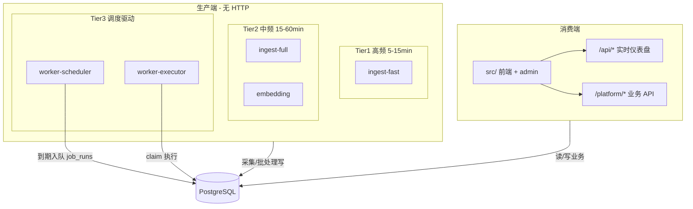
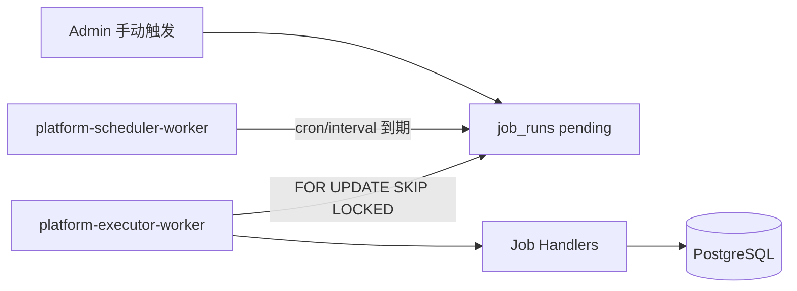

# Platform 消费端 / 生产端拆分设计

> **状态：** Job 调度器已落地；总览见 [系统目标与架构.md](./系统目标与架构.md)，进度见 [功能清单.md](./功能清单.md)  
> **关联：** [Platform后台启动与运行设计.md](./Platform后台启动与运行设计.md) · [deploy/README.md](../deploy/README.md) · [文档索引](./README.md)

---

## 1. 目标

将系统拆为两个可独立部署的子系统：

| 子系统 | 职责 | HTTP |
|--------|------|------|
| **消费端 Consumer** | 前端 SPA、`/api/*` sebuf 网关、`/platform/*` Platform API | **提供** |
| **生产端 Producer** | RSS/股票/财报采集、向量化、订阅投递、知识图谱构建、冷归档等 | **不提供** |

集成点：**PostgreSQL**（主）、**Redis**（可选队列）、**OSS**（冷数据/大文件）。

---

## 2. 总体架构



---

## 3. 生产端 Worker 分档

| 档位 | 运行方式 | 典型任务 | 默认频率 |
|------|----------|----------|----------|
| **Tier 1** | 常驻 `setInterval` 或 scheduler 触发 | RSS 快讯子集 | 5–15 分钟 |
| **Tier 2** | 常驻 | RSS 全量、Embedding | 15–30 分钟 / 5–30 分钟 |
| **Tier 3** | **scheduler + executor** | 订阅、冷归档、股票资讯、财报、知识图谱 | cron / 日批 |

### 实时 vs 准实时

- **`/api/*`（地震、市场、航班等）**：仍在消费端按需拉上游，**不经过生产端 Worker**。
- **PG 新闻 digest**：Tier1/2 Ingest 写 `news_items`，消费端读 PG；新鲜度 ≈ Ingest 间隔 + 前端刷新（15min）。
- **股票/财报/图谱**：Tier3 日批或交易时段 cron，与快讯链路解耦。

---

## 4. 调度体系（核心）

### 4.1 Scheduler 与 Executor 分离



| 进程 | npm 脚本 | 职责 |
|------|----------|------|
| **Scheduler** | `npm run platform:scheduler` | leader 锁、扫描 `job_definitions`、创建 `job_runs`、更新 `next_run_at` |
| **Executor** | `npm run platform:executor` | claim pending runs、并发控制、超时、调用 handler |

**原则：Scheduler 只调度，Executor 只执行。** 知识图谱等长任务不得阻塞调度循环。

### 4.2 数据模型（`deploy/init/022_schema_job_scheduler.sql`）

**`job_definitions`** — 任务模板

| 字段 | 说明 |
|------|------|
| `handler_key` | 唯一标识，如 `subscription-match-deliver` |
| `schedule_kind` | `interval` \| `cron` |
| `interval_seconds` / `cron_expr` / `timezone` | 调度表达式 |
| `max_concurrency` | 同 handler 全局并发上限（图谱建议 1） |
| `timeout_sec` | 单 run 超时秒数 |
| `payload_json` | 默认参数 |

**`job_runs`** — 执行实例

| 字段 | 说明 |
|------|------|
| `status` | `pending` → `running` → `succeeded` \| `failed` |
| `scheduled_at` / `started_at` / `finished_at` | 时间线 |
| `locked_by` / `locked_until` | claim 锁 |
| `stats_json` / `error_message` | 结果 |

### 4.3 Handler 注册表

代码路径：`server/platform/jobs/`

| handler_key | 状态 | 说明 |
|-------------|------|------|
| `subscription-match-deliver` | **已实现** | 订阅匹配 + 邮件 |
| `cold-tier-archive` | **已实现** | 冷数据归档（需 OSS） |
| `rss-ingest-fast` | **已实现** | RSS 快讯子集（Tier1，默认 10 分钟调度） |
| `rss-ingest-full` | **已实现** | RSS 全量采集（Tier2） |
| `embedding-batch` | **已实现** | 向量化 batch |
| `stock-news-ingest` | **已实现** | finance 分类 RSS → `news_items` |
| `earnings-ingest` | **已实现** | 财报/SEC  RSS → `company_filings` |
| `knowledge-graph-build` | **MVP** | 公司实体 + `mentioned_in` 边（PG 图谱表） |

### 4.4 Admin API（Phase 2）

| 方法 | 路径 | 说明 |
|------|------|------|
| GET | `/platform/v1/admin/jobs/handlers` | 已注册 handler 列表 |
| GET | `/platform/v1/admin/jobs/definitions` | 任务定义与 next_run |
| GET | `/platform/v1/admin/jobs/runs?limit=30` | 最近执行记录 |
| GET | `/platform/v1/admin/jobs/checkpoints` | 各 handler 最近 checkpoint |
| GET | `/platform/v1/admin/jobs/dag-status` | 知识图谱 DAG 就绪状态 |
| POST | `/platform/v1/admin/jobs/enqueue` | `{ "handlerKey": "rss-ingest-full", "payload": { "all": true } }` |
| PATCH | `/platform/v1/admin/jobs/definitions/:handlerKey` | `{ "enabled": true }` |

`POST /platform/v1/ingest/run`、`/embedding/run`、`/cold-tier/run` 默认 **202 入队**；需同步执行时设 `PLATFORM_ALLOW_SYNC_JOBS=true`（仅调试）。

Admin `POST /platform/v1/admin/run/match-all`、`/run/deliver-all` 与 Platform `POST /platform/v1/subscriptions/match-all`、`/deliver-all` 同样默认入队 `subscription-match-deliver`（payload：`mode: match|deliver`）。

消费端 Admin 后续只 **enqueue** `job_runs`，不在 API 进程内 `await` 重任务。

### 4.4 未来任务调度示例

| 任务 | cron 示例 | timezone | timeout |
|------|-----------|----------|---------|
| 股票资讯 | `*/15 9-16 * * 1-5` | `America/New_York` | 900s |
| 财报 | `0 6 * * *` | `Asia/Shanghai` | 1800s |
| 知识图谱 | `0 2 * * *` | `Asia/Shanghai` | 14400s |

可选 DAG：资讯 + 财报成功后触发图谱（Phase 2）。

---

## 5. 进程隔离与 PostgreSQL

- API / Ingest / Scheduler / Executor 为 **独立 Node 进程**，互不阻塞 event loop。
- 共享 PG：Ingest 批量 upsert 时 digest 查询可能 **短暂变慢**（非死锁）。
- 同一 handler **多副本** 需 `max_concurrency` + claim 锁，避免重复全量采集。

详见 [Platform后台启动与运行设计.md §十](./Platform后台启动与运行设计.md)。

---

## 6. 仓库结构（目标 Monorepo）

```
packages/
  consumer/     # src, api, server/worldmonitor, platform-api
  producer/     # workers, jobs, scheduler
  shared/       # db, migrations, logger
proto/
deploy/
  consumer/
  producer/
```

**Phase 3  Monorepo：** 见 [Platform-Monorepo拆分说明.md](./Platform-Monorepo拆分说明.md) · [MONOREPO.md](./MONOREPO.md)

---

## 7. 部署

### 开发

```powershell
# 消费端
npm run platform:api
npm run dev

# 生产端（scheduler + executor 可合并为一条命令）
npm run platform:producer
# 或分别：
npm run platform:scheduler
npm run platform:executor
npm run platform:ingest:fast   # 可选 Tier1（或依赖 scheduler 的 rss-ingest-fast）
npm run platform:ingest          # 可选 Tier2 全量
```

### 生产（示意）

| 服务 | 副本 | 说明 |
|------|------|------|
| consumer-api + static | 2+ | HTTP |
| platform-scheduler | 1（leader） | 调度 |
| platform-executor | 1–2 | 批处理 |
| platform-ingest-fast | 0–1 | 可选 |

---

## 8. 实施阶段

| 阶段 | 内容 | 状态 |
|------|------|------|
| **P1** | Job 表 + scheduler/executor + 内置 handler | **已完成** |
| **P2** | Admin enqueue、API 改入队（ingest/embed/cold-tier） | **已完成**（含 Admin UI「后台任务」页） |
| **P2** | Admin 触发 enqueue、迁移 POST /ingest/run |
| **P3** | RSS fast/full 分档 | **已完成**（handler + ingest-fast worker + 调度种子） |
| **P3** | Monorepo 拆分 | **已落地**（`apps/*` + `packages/*`，见 [MONOREPO.md](./MONOREPO.md)） |
| **P4** | stock-news / earnings / kg 真实数据源 | **MVP 已落地**（RSS→PG；图谱为标题匹配 MVP） |
| **P5** | 图谱 DAG、checkpoint、Neo4j 可选 | **部分完成**（DAG + checkpoint API/UI；Neo4j 未接） |

---

## 9. 工作量参考

| 范围 | 人日（1 人） |
|------|-------------|
| P1 调度器基础 | 5–8 |
| MVP 消费/生产拆分 | 14–19 |
| 生产级 + Monorepo + 插件化 Ingest | 29–41 |
| Scheduler 全量 + 三业务骨架 | +15–21（含 P1） |
| 每个新数据源对接 | 2–5 |

---

## 10. 源码索引

| 模块 | 路径 |
|------|------|
| Job 迁移 | `deploy/init/022_schema_job_scheduler.sql` |
| Job 仓库 | `server/platform/jobs/job-repository.ts` |
| 股票/财报采集 | `server/platform/equity-ingest.ts` |
| Handler 注册 | `server/platform/jobs/registry.ts` |
| Scheduler Worker | `scripts/platform-scheduler-worker.ts` |
| Executor Worker | `scripts/platform-executor-worker.ts` |
| 种子任务 | `server/platform/jobs/job-seed.ts` |
