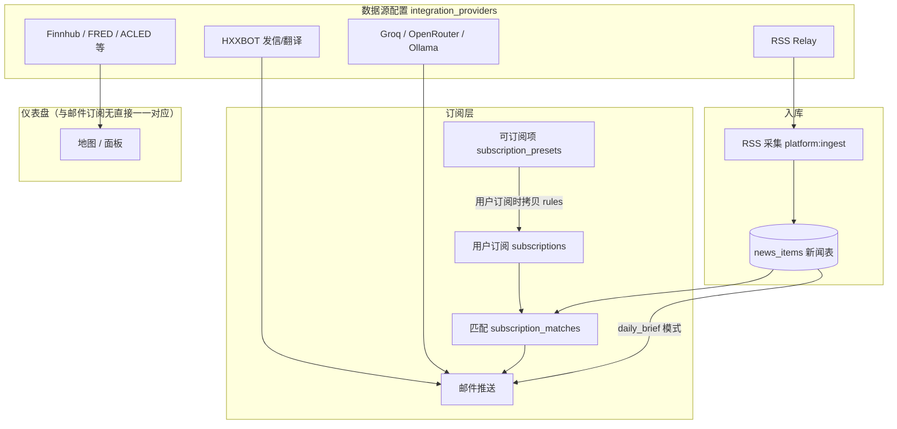

# 数据源配置与可订阅项的关系说明

管理后台 **数据源配置** 往往有十多条记录，而 **可订阅项** 默认只有 4 条。二者**不是一一对应**，数量不同是正常现象。

本文说明各自职责、数据流，以及它们如何**间接**关联。

相关文档：

- [订阅与可订阅项说明.md](./订阅与可订阅项说明.md) — 可订阅项 vs 用户订阅规则
- [数据源DB化与订阅策略方案.md](./数据源DB化与订阅策略方案.md) — `integration_providers` 设计与 Phase 规划

相关代码：

- 数据源 catalog：`server/platform/integration-provider-catalog.ts`
- 数据源仓储：`server/platform/integration-providers-repository.ts`
- 可订阅项：`server/platform/preset-repository.ts`
- 订阅规则：`server/platform/subscription-rules.ts`
- 新闻入库 / 匹配 / 发信：`server/platform/news-repository.ts`、`subscription-matcher.ts`、`subscription-delivery-service.ts`

---

## 1. 一句话区分

| 管理后台 | 数据库表 | 是什么 |
|----------|----------|--------|
| **数据源配置** | `integration_providers` | 第三方 API 的 **Base URL + API Key**（地图、行情、AI、发邮件等**能力凭证**） |
| **可订阅项** | `subscription_presets` | 邮件订阅的 **产品套餐模板**（能订什么、默认筛选规则、用什么语言发） |

- **数据源有 10+ 条**：内置 catalog 为每种外部 API 各占一行（HXXBOT、Finnhub、FRED、Relay 等）。
- **可订阅项默认 4 条**：migration 种子只预置 4 个邮件套餐（中英简报、科技简报、冲突关键词）。

---

## 2. 各自做什么

### 2.1 数据源配置（integration_providers）

启动时按 `integration-provider-catalog.ts` 自动 seed，典型 slug 包括：

| 类型 | 示例 slug | 用途 |
|------|-----------|------|
| 平台 | `hxxbot` | 发邮件、翻译、部分 AI 能力 |
| AI | `groq`、`openrouter`、`ollama` | AI 摘要（管理后台「AI 模型」页） |
| 行情 / 宏观 | `finnhub`、`fred`、`eia`、`wto` | 地图面板、经济指标 |
| 地缘 / 军事 / 环境 | `acled`、`nasa_firms`、`wingbits` | 地图图层数据 |
| 航空 | `aviationstack`、`icao` | 航班相关 |
| 安全 | `urlhaus`、`otx`、`abuseipdb` | 网络威胁 |
| 中继 | `relay` | RSS 代理 |

**作用**：为仪表盘地图/面板、新闻入库辅助、发信、AI 等提供「如何连接外部服务」，**不是**给用户直接勾选订阅的菜单项。

数据库通常只存：`base_url`、加密 `api_key`、`enabled`（及 AI 的 `model_name` 等）。具体 API 路径写死在业务代码里。

### 2.2 可订阅项（subscription_presets）

默认种子见 `deploy/init/004_schema_subscription_catalog.sql`：

| slug | 名称 | 规则要点 |
|------|------|----------|
| `daily-brief-zh` | 每日世界简报（中文） | `mode: daily_brief`，中文投递 |
| `daily-brief-en` | Daily World Brief (English) | `mode: daily_brief`，英文 |
| `tech-daily` | 科技每日简报 | `variant: tech` |
| `conflict-watch` | 冲突与地缘关键词 | `mode: keyword`，分类 + 关键词 |

**作用**：定义用户能订哪些**邮件产品**，以及默认 `rules_json`（模式、分类、关键词、语言、时间窗口等）。

用户订阅时，系统将预设规则**复制**到 `subscriptions.rules_json`，并记录 `preset_id`。之后匹配与发信**只读订阅上的规则快照**，修改可订阅项默认值**不会**自动改已有订阅。

---

## 3. 有没有直接映射表？

**没有。**

不存在 `preset_id → integration_slug` 或「一条数据源 = 一条可订阅项」的外键关系。

关联是**间接**的，通过数据流与共享服务完成。

---

## 4. 数据流（间接关联）

### 4.1 订阅匹配什么？

- 对象：**`news_items`**（RSS 等平台入库后的新闻）。
- 依据：可订阅项 / 用户订阅里的 `rules_json`：
  - `mode`：`daily_brief`（AI 简报）或 `keyword`（关键词/分类匹配）
  - `categories`、`keywords`、`variant`
  - `contentLangs` / `deliveryLang`（来源语言 vs 邮件语言）
  - `hours`、`maxItems` 等

**不是**按数据源列表逐条 slug 映射。

### 4.2 发信与 AI 用谁？

- **HXXBOT**（`integration_providers` 中 `hxxbot`）：发邮件、翻译等。
- **AI 模型**（Groq 等）：生成简报摘要时按需读取。

这些是**全平台共享基础设施**，多个可订阅项共用，而非每个可订阅项绑定一个数据源。

### 4.3 地图数据源与订阅的关系

Finnhub、ACLED、NASA FIRMS 等主要用于**首页地图与面板**，与邮件可订阅项**没有直接对应**。

除非单独设计「订阅某类地图事件」类产品，当前架构下邮件订阅只消费 **`news_items` + 简报服务**。

---

## 5. 为什么数量差这么多？

| 现象 | 原因 |
|------|------|
| 数据源 10+ 条 | catalog 为每种外部 API 预置一行，覆盖地图、AI、中继、发信等**多种能力** |
| 可订阅项 4 条 | 种子 migration 只插入 4 个**邮件套餐**；前台 catalog 仅展示 `enabled = true` 的预设 |

二者服务**不同产品层**：

- 数据源 → **技术能力**（能不能拉数据、能不能发信）
- 可订阅项 → **业务套餐**（用户订什么邮件、默认怎么筛）

---

## 6. 日常操作指引

### 想增加可订阅项

1. 管理后台 → **可订阅项** → 新建。
2. 配置 `rules_json`（模式、分类、关键词、语言等）。
3. 与数据源条数**无关**；无需为每个数据源建一条可订阅项。

### 想增加 / 启用数据源

1. 管理后台 → **数据源配置**（或 **AI 模型**）。
2. 填写 Base URL、API Key、启用开关。
3. 影响地图、入库、发信、AI 等**能力**，**不会**自动新增可订阅项。

### 若希望「某类内容单独可订」

在 **可订阅项** 中手工创建预设，例如：

- `categories: ["tech"]` — 只匹配 tech 分类新闻
- `keywords: ["semiconductor", "AI"]` — 关键词订阅
- `variant: "tech"` — 限定入库 variant

并在 **RSS 入库** 侧保证对应分类/variant 的新闻进入 `news_items`。

---

## 7. 常见问题

**Q：为什么配置了 Finnhub，可订阅项里没有「行情订阅」？**

A：Finnhub 服务的是**地图行情面板**，不是邮件 preset。邮件订阅读的是 `news_items` 与简报规则，二者分层不同。

**Q：改可订阅项默认值，老用户会跟着变吗？**

A：不会。规则在订阅创建时已**快照**到 `subscriptions.rules_json`。要改老用户行为，请编辑 **用户订阅**。

**Q：HXXBOT 和可订阅项是什么关系？**

A：HXXBOT 是**发信/翻译通道**（数据源之一）。所有邮件类可订阅项发信时都依赖它（若未配置则无法发邮件），但不是「一个 HXXBOT = 一个可订阅项」。

**Q：能否做成每个数据源一个订阅套餐？**

A：可以，但需**产品化设计**：在可订阅项里为每种内容定义 `rules_json`，并保证有对应数据进入 `news_items`。系统**不会**根据 `integration_providers` 自动生成 preset。

---

## 8. 相关 API（便于联调）

| 端点 | 说明 |
|------|------|
| `GET /platform/v1/auth/catalog` | 用户可见的可订阅项（enabled 预设） |
| `GET /platform/v1/admin/presets` | 管理员可订阅项 CRUD |
| `GET /platform/v1/admin/integrations` | 管理员数据源列表 |
| `GET /platform/v1/admin/ai-models` | 管理员 AI 模型列表 |

Open API 订阅管理见 [OPEN_API_SUBSCRIPTIONS.md](./OPEN_API_SUBSCRIPTIONS.md)。
