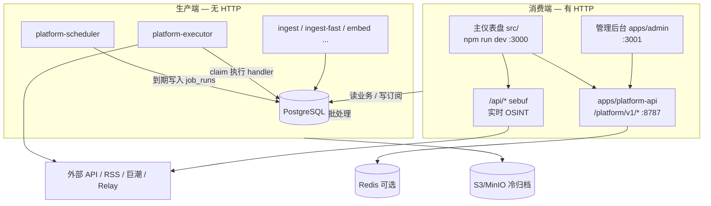
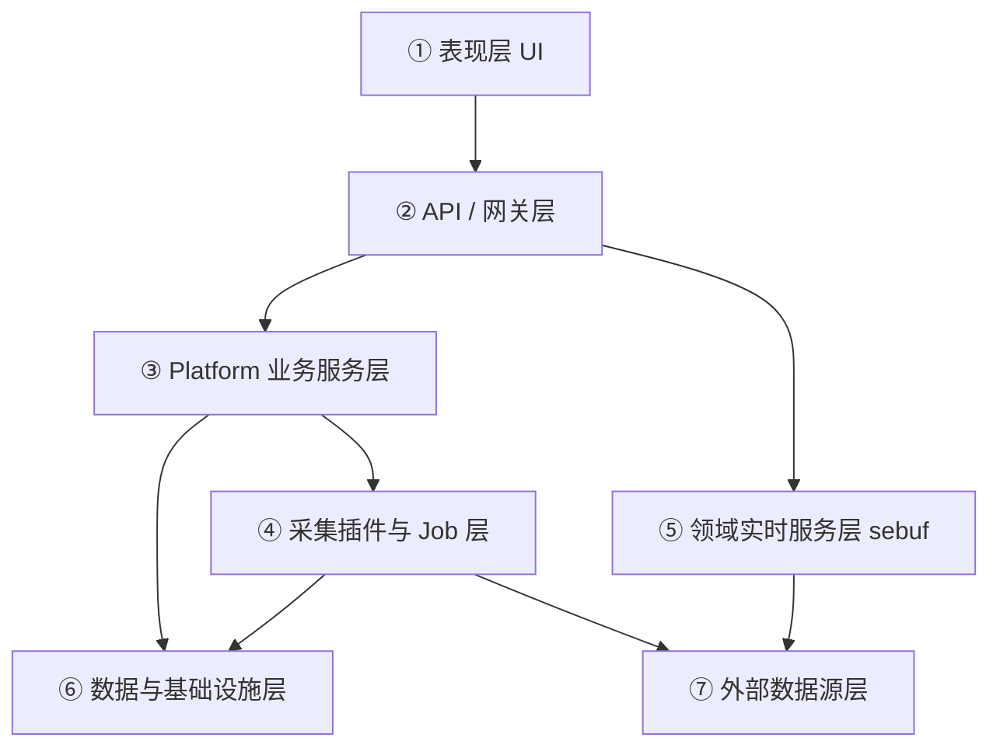

# 系统目标与架构

> **权威文档** · 版本对齐 world-monitor **2.5.23** · **仅 B/S 交付**（不支持桌面打包）  
> 关联：[数据源说明.md](./数据源说明.md) · [功能清单.md](./功能清单.md) · [文档说明清单.md](./文档说明清单.md)

---

## 1. 系统想实现的目标

### 1.1 产品一句话

**World Monitor** 是实时全球态势感知仪表盘：把新闻、地缘、市场、军事、基础设施、自然灾害等多源情报，聚合成统一的地图 + 面板作战图（OSINT），并在此基础上提供**可自托管的数据平台**（入库、邮件订阅、管理后台、企业图谱）。

### 1.2 目标拆解

| 目标 | 说明 |
|------|------|
| **统一态势感知** | 3D/2D 地图（40+ 图层）+ 可配置面板；变体 `full` / `tech` / `finance` / `happy` 共用一套代码 |
| **多源实时情报** | ~150 RSS + 30+ 外部 API；无 Key 也能跑核心能力，有 Key 则增强对应图层/面板 |
| **AI 辅助研判** | LLM 世界简报、焦点检测、（可选）本地 Ollama；自托管侧接 HXXBOT / Groq 等 |
| **自托管商业底座** | PostgreSQL 新闻入库 → 邮件订阅（分类/关键词/语言）→ Admin；为 Research / Agent / 企业 API 预留表与进程 |
| **企业披露与图谱** | 以巨潮（CNINFO）为切入，采集上市公司公告并抽取关系，在前端「企业图谱」展示；美/港/欧市场预留 |

### 1.3 明确不做（当前阶段边界）

- Phase 1 不以 Webhook / IM（飞书、企微、Slack）为主交付（企业通道预留）。
- 披露抓取**不**接巨潮官方付费数据 API（成本过高），走站点 + Firecrawl 等采集引擎。
- 仪表盘实时图层（地震、GDELT、航班等）**不**强制进生产端 Worker；与 PG 新闻链路解耦。

### 1.4 产品文案锚点（商业路线）

| 阶段 | 对外能力表述 |
|------|----------------|
| Monitor | 全球新闻一站监控，AI 每日简报，邮件准时送达 |
| Research | 竞品 / 品牌 / 行业追踪与对比报告（部分 API 已有，前端未产品化） |
| Agent | 从洞察到行动的 Agent（未实现） |
| Enterprise | 公开 API、Webhook、IM 适配（未实现） |

---

## 2. 当前主要架构设计

### 2.1 双网关 + 消费 / 生产分离

系统在 monorepo 内同时存在两条主链路：



| 子系统 | 典型进程 | HTTP | 职责 |
|--------|----------|------|------|
| **消费端** | 根 Vite、`platform-api`、`admin` | 是 | 给用户/管理端提供读接口与配置 |
| **生产端** | `platform-scheduler`、`platform-executor`、可选 ingest/embed | 否 | 定时采集、匹配发信、图谱、归档 |

**原则：** Scheduler 只调度，Executor 只执行；长任务不得阻塞调度循环。

### 2.2 Monorepo 目录（已落地 npm workspaces）

```
hxxworldmonitor/
├── apps/
│   ├── platform-api/           # Platform REST
│   ├── platform-scheduler/     # 扫 job_definitions → 入队
│   ├── platform-executor/      # claim job_runs → handler
│   ├── platform-ingest*/       # 可选常驻 RSS Worker
│   ├── platform-embed/         # 向量化 Worker
│   ├── platform-subscription/  # 可选；推荐改用 scheduler 任务
│   ├── platform-db-*/          # DB init / migrate CLI
│   ├── platform-admin-init/    # 创建管理员
│   ├── admin/                  # 管理后台 SPA
│   └── frontend/               # 占位；主 UI 源码仍在根 src/
├── packages/
│   ├── shared/                 # DB、日志、OSS、JWT、load-env
│   └── platform-core/          # 业务、Job、RSS、订阅、Admin API、ingest 插件
├── server/
│   ├── _shared/ · platform/    # 兼容 shim → packages（勿直接改）
│   └── worldmonitor/           # sebuf 领域 handler（仍绑根 Vite）
├── src/                        # 主仪表盘前端
├── api/                        # Vercel Edge 兼容层（部分）
└── deploy/                     # docker-compose + SQL 迁移
```

环境变量加载顺序（`packages/shared/src/load-env.ts`）：**当前工作目录** `.env.local` → **仓库根** `.env.local`。

### 2.3 运行时端口速查

| 服务 | 命令 | 端口 |
|------|------|------|
| 主仪表盘 + Vite sebuf | `npm run dev` | 3000 |
| 管理后台 | `npm run admin:dev` | 3001 |
| Platform API | `npm run platform:api` | 8787（`PLATFORM_API_PORT`） |
| PG / Redis / MinIO | `npm run platform:up` | 见 `deploy/docker-compose.yml` |

前端通过 `VITE_PLATFORM_API_URL`（如 `http://localhost:8787`）访问 Platform；未配置时部分能力仅走本地 `/api`。

### 2.4 存储与集成点

| 组件 | 用途 |
|------|------|
| **PostgreSQL**（建议 16 + 可选 pgvector） | 新闻、用户订阅、Job、集成凭证、企业图谱/披露 |
| **Redis** | 可选；embedding 队列、事件流预留 |
| **OSS / MinIO** | 冷归档、翻译缓存大对象等 |
| **HXXBOT** | 发信、翻译、问答等平台能力 |
| **Firecrawl**（采集引擎） | 披露页/PDF 抓取（与业务数据源分离配置） |

---

## 3. 分层与各层功能

从上到下共 **7 层**（逻辑分层，非严格包边界）：



### ① 表现层（UI）

| 模块 | 路径 | 功能 |
|------|------|------|
| 主仪表盘 | `src/` | 地图、面板、变体、企业图谱视图、i18n |
| 管理后台 | `apps/admin/` | 用户、可订阅项、数据源、采集引擎、后台任务、披露统计、日志 |

### ② API / 网关层

| 网关 | 路径模式 | 功能 |
|------|----------|------|
| **Sebuf / 实时** | `/api/{domain}/v1/*` | 仪表盘按需拉上游（冲突、地震、市场等）；开发态由 Vite `ssrLoadModule` 加载 |
| **Platform** | `/platform/v1/*` | 鉴权、digest、订阅、简报、Research、Admin、enterprise-graph |
| **兼容代理** | Vite `server.proxy`、`api/*.js` | RSS 代理、部分 Edge / 同源兼容 |

### ③ Platform 业务服务层（`packages/platform-core`）

- 新闻 digest（PG）、简报、订阅匹配与投递  
- Admin API、集成凭证读写、HXXBOT 封装  
- 企业图谱查询、披露统计、关系抽取触发  
- Job 入队辅助（Admin 手动触发）

共享底座在 `packages/shared`：连接池、加密配置、日志、对象存储、JWT。

### ④ 采集插件与 Job 层

| 概念 | 说明 |
|------|------|
| **Ingest 插件** | `packages/platform-core/src/ingest-plugins/` 注册表；薄封装真实采集逻辑 |
| **Job 定义** | 表 `job_definitions`；种子见 `jobs/job-seed.ts` |
| **Scheduler / Executor** | 扫描到期任务 → `job_runs` → claim 执行 |
| **采集绑定** | `data_source_ingest_bindings`：数据源 ↔ 引擎 ↔ 插件（如 cninfo → firecrawl → cninfo-disclosure） |

### ⑤ 领域实时服务层（sebuf）

`server/worldmonitor/{domain}/v1/handler` + `src/generated/server/...`：按 Proto 暴露地震、野火、气候、航空、新闻、军事等 **按需** 接口。  
**不经过** Scheduler；新鲜度取决于上游与前端刷新。

### ⑥ 数据与基础设施层

- 迁移：`deploy/init/*.sql`（经 `platform-db-migrate` / bootstrap）  
- 表域：新闻与向量、订阅目录、集成与引擎、Job、上市公司与公告、KG 实体边等  
- 可选 Redis / MinIO

### ⑦ 外部数据源层

见 [数据源说明.md](./数据源说明.md)：公开 API、需 Key API、RSS、Relay、披露站点、采集引擎。

---

## 4. 已知架构限制（诚实清单）

| 项 | 现状 |
|----|------|
| 主仪表盘 `src/` | 尚未完全迁入 `apps/frontend` |
| sebuf | 仍耦合根 `vite.config.ts` + `server/worldmonitor/` |
| `server/_shared`、`server/platform` | 仅为 shim，新代码只改 `packages/` |
| 部分 handler 仍读 `process.env` | 数据源 DB 化 Phase 2 未完成（见功能清单） |
| `shared` ↔ `platform-core` | `hxxbot-config` 存在循环依赖（运行时可接受） |

---

## 5. 相关深入阅读

| 主题 | 文档 |
|------|------|
| workspaces 改码指南 | [Platform-Monorepo拆分说明.md](./Platform-Monorepo拆分说明.md) |
| Job / 消费生产 | [Platform消费生产端拆分设计.md](./Platform消费生产端拆分设计.md) |
| 启动顺序 | [Platform后台启动与运行设计.md](./Platform后台启动与运行设计.md) |
| 部署 | [deploy/README.md](../deploy/README.md) |
| 产品英文长文档 | [DOCUMENTATION.md](./DOCUMENTATION.md) |
