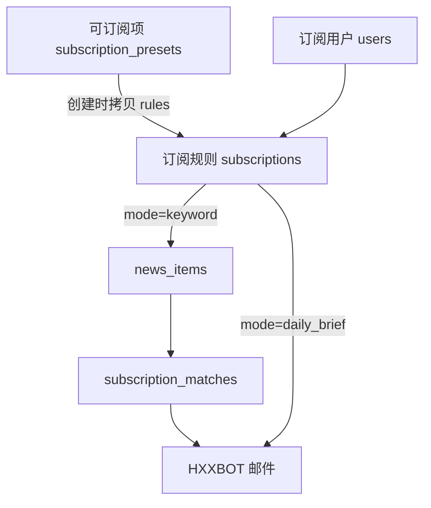

# 可订阅项与订阅规则说明

管理后台 **可订阅项** 与 **订阅规则** 容易混淆。本文说明二者关系、数据流及日常操作。

相关代码：

- 表结构：`deploy/init/001_schema.sql`、`deploy/init/004_schema_subscription_catalog.sql`
- 规则类型：`server/platform/subscription-rules.ts`
- 匹配 / 发信：`server/platform/subscription-matcher.ts`、`subscription-delivery-service.ts`
- 用户自助：`server/platform/user-subscription-service.ts`、前端 `UserAccountMenu.ts`

---

## 1. 一句话区分

| 管理后台 | 数据库表 | 含义 |
|----------|----------|------|
| **可订阅项** | `subscription_presets` | **产品目录 / 套餐模板** — 定义「能订什么、默认规则是什么」 |
| **订阅规则** | `subscriptions` | **某用户的实际订阅** — 定义「谁订了、用什么规则发邮件」 |
| **订阅用户** | `users` | 收邮件的账号（邮箱、密码、首选语言） |

类比：

- **可订阅项** = 菜单上的「每日世界简报（中文）」「冲突关键词监控」
- **订阅规则** = 张三订了简报、李四订了冲突监控

---

## 2. 数据关系



- 一条 **可订阅项** 可被多个用户分别订阅（每人一条 **订阅**）。
- `subscriptions.preset_id` 可选：有值表示来源于某预设；为空表示 **完全自定义**。
- 匹配结果写入 `subscription_matches`；发信记录见 `notification_deliveries`。

---

## 3. 可订阅项（Presets）

### 3.1 作用

- 维护对外展示的 **订阅套餐**（标题、slug、说明、默认 `rules_json`）。
- 控制是否在用户 catalog 中出现（`enabled`）。
- 用户在前端 **账户 → 个人资料** 中看到的列表来自 `GET /platform/v1/auth/catalog`（仅 **enabled** 预设）。

### 3.2 内置种子示例

Migration `004_schema_subscription_catalog.sql` 默认写入：

| slug | 名称 | 模式 |
|------|------|------|
| `daily-brief-zh` | 每日世界简报（中文） | `daily_brief` |
| `daily-brief-en` | Daily World Brief (English) | `daily_brief` |
| `tech-daily` | 科技每日简报 | `daily_brief` |
| `conflict-watch` | 冲突与地缘关键词 | `keyword` |

### 3.3 管理员操作

- **新建 / 编辑**：配置默认规则（模式、分类、关键词、语言等）。
- **停用**：用户 catalog 不再显示；**已有订阅不会自动删除**。
- **删除**：删除预设行；已关联的 `subscriptions.preset_id` 可能变为 NULL（取决于外键 `ON DELETE SET NULL`）。

---

## 4. 订阅规则（Subscriptions）

### 4.1 创建方式

**方式 A — 用户自助**

1. 用户登录后在个人资料页点击「订阅」。
2. API：`POST /platform/v1/auth/subscriptions`， body `{ presetId }`。
3. 系统将预设的 `rules_json` **复制** 到 `subscriptions.rules_json`，并写入 `preset_id`。

**方式 B — 管理员代建**

1. **用户订阅 → 新建订阅**，选择用户（或输入新邮箱自动建用户）。
2. 可选「基于可订阅项」；在「规则详情」中可 **覆盖** 预设字段。
3. 不选预设 = 完全自定义规则。

规则合并逻辑（`subscription-repository.ts` → `resolveRules`）：

```
有 preset_id → rules = merge(预设.rules_json, 表单.rules_json)
无 preset_id → rules = 表单.rules_json
```

### 4.2 重要：规则是「快照」

保存后，**匹配与发信只读 `subscriptions.rules_json`**。

- 之后修改 **可订阅项** 的默认规则，**不会** 自动更新已有订阅。
- 若要调整老用户行为，请编辑 **用户订阅** 中对应行。

### 4.3 管理员在哪里查看 / 修改用户订阅？

前端用户自助订阅后，数据写入同一张 `subscriptions` 表。管理后台：

| 入口 | 能力 |
|------|------|
| **用户订阅**（原「订阅规则」） | 列出全部用户订阅；**编辑**规则、启用/停用、删除；单条匹配/发信 |
| **订阅用户** → 列「订阅」/ 按钮「订阅」 | 查看该用户订阅数量，跳转到 **用户订阅** 并筛选该用户 |

管理员权限包括：强制修改任意用户的 `rules_json`、停用订阅、删除订阅、代用户新建订阅。

### 4.4 单条操作

| 操作 | 说明 |
|------|------|
| 编辑 | 改名称、规则、启用状态、关联预设 |
| 匹配 | 按规则扫描 `news_items`，写入 `subscription_matches`（`daily_brief` 模式跳过） |
| 发信 | 对未通知的匹配发邮件，或发送 AI 简报（需 HXXBOT 已配置） |
| 删除 | 删除订阅及关联匹配记录 |

---

## 5. rules_json 字段说明

定义见 `server/platform/subscription-rules.ts`。

### 5.1 模式（核心）

| mode | 名称 | 行为 |
|------|------|------|
| `daily_brief` | 每日 AI 简报 | **不匹配新闻**；发信时调用 AI 生成全球简报 |
| `keyword` | 关键词/分类匹配 | 匹配新闻 → AI 生成匹配简报 → 邮件（正文 + 参考来源链接） |

### 5.2 常用字段

| 字段 | 说明 |
|------|------|
| `variant` | 站点变体：`full` / `tech` / `finance` / `happy` |
| `deliveryLang` | **邮件内容** 语言（标题可经翻译服务转换） |
| `contentLangs` | **已废弃**（历史字段，匹配时忽略） |
| `categories` | 新闻分类，如 `conflict`、`tech` |
| `keywords` | 标题关键词，逗号分隔，满足任一即可 |
| `hours` | 回溯小时数，默认 24 |
| `maxItems` | 单次匹配上限，最大 50 |
| `includeAiBrief` | `keyword` 模式下是否在匹配简报之外再附带一份全球 variant AI 简报 |

### 5.3 多语言：匹配 vs 发信

订阅按 **数据源规则**（`variant`、分类、关键词）匹配，**不按** `news_items.lang` 过滤。

| 阶段 | 语言如何处理 |
|------|----------------|
| **匹配** | 只看 variant / 分类 / 关键词 / 回溯小时，中英文新闻一视同仁 |
| **发信（关键词 digest）** | 每条新闻单独判断：`news_items.lang` 与投递语言（`users.preferred_lang` 或 `deliveryLang`）相同则原文发送，否则经 `translation-service` 翻译 |
| **发信（AI 简报）** | 从该 variant 下全部近期新闻取料，AI 按投递语言生成正文 |

前端「订阅语言」= 用户 `preferred_lang`，只影响 **邮件与 AI 输出语言**，不影响匹配池。

### 5.4 发送方式（用户级）

| 字段 | 说明 |
|------|------|
| `delivery_mode` | `individual`（默认）= 每个订阅单独发信；`merged` = 多订阅合并为一封 |
| `merged_delivery_time` | 每日发送时间 `HH:MM`（**单独/合并均适用**），默认 `08:00` |
| `merged_delivery_timezone` | IANA 时区，默认 `Asia/Shanghai` |

- **单独发送**：到点每个订阅各发一封（同一天只发一轮）。
- **合并发送**：到点所有订阅合并为一封。
- 定时任务 `npm run platform:subscription` 按 worker 间隔检查时间窗口；管理后台手动发信立即触发。

---

## 6. 匹配与发信流程

**匹配与发信** 是管理员批量（或单条）执行邮件推送的两步操作，入口在管理后台侧栏 **匹配与发信**，或在 **用户订阅** 每行的「匹配 / 发信」按钮。

| 步骤 | 作用 | 适用订阅 |
|------|------|----------|
| **匹配** | 按 `rules_json` 扫描 `news_items`，新命中写入 `subscription_matches` | `mode=keyword` |
| **发信** | 将未通知的匹配发邮件；或生成 AI 简报发送 | 全部（`daily_brief` 只发 AI 简报） |

```
ingest worker → news_items 入库
       ↓
匹配（match / 全量匹配 / platform-subscription worker）
  · daily_brief 订阅 → 跳过
  · keyword 订阅 → SQL + 关键词过滤 → subscription_matches（去重）
       ↓
发信（deliver / 全量发信）
  · daily_brief → generateAiBrief → HXXBOT 发信
  · keyword → 待通知 matches → 可选翻译 → 发信 → notified=true
```

管理后台 **匹配与发信** 页：先 **全量匹配**，再 **全量发信**。定时任务可运行：

```bash
npm run platform:subscription:once   # 匹配 + 发信一轮
npm run platform:subscription        # 常驻 worker
```

---

## 7. 系统设置（与订阅相关）

**系统设置** 中：

| 字段 | 说明 |
|------|------|
| `self_service_subscriptions_enabled` | 关闭后用户无法自助订阅/取消，API 拒绝 |
| `max_subscriptions_per_user` | 每用户活跃订阅上限；`0` = 不限制 |

单项上下架仍用 **可订阅项** 的 `enabled` 开关。

---

## 8. 常见问题

**Q：为什么两个菜单都能配规则？**  
A：可订阅项 = 模板；订阅规则 = 用户实例。用户订的是拷贝到订阅里的规则。

**Q：改预设后老用户会变吗？**  
A：不会自动变，需编辑对应 **订阅规则**。

**Q：「订阅规则」是全局过滤配置吗？**  
A：不是。它是 **按用户** 的邮件订阅列表，每条订阅独立匹配、独立发信。

**Q：daily_brief 为什么还要建订阅？**  
A：用于区分收件人、订阅名称、variant、邮件语言等；内容走 AI 简报而非新闻库。

**Q：发信失败？**  
A：检查 **数据源配置** 中 HXXBOT 是否已配置；**订阅用户** 邮箱是否有效。

---

## 9. API 速查

| 端点 | 角色 | 说明 |
|------|------|------|
| `GET /platform/v1/auth/catalog` | 用户 | 可订预设 + 已订状态 + 上限 |
| `POST /platform/v1/auth/subscriptions` | 用户 | `{ presetId }` 订阅 |
| `DELETE /platform/v1/auth/subscriptions/:id` | 用户 | 取消订阅 |
| `GET/POST/PATCH/DELETE /platform/v1/admin/presets` | 管理员 | 可订阅项 CRUD |
| `GET/POST/PATCH/DELETE /platform/v1/admin/subscriptions` | 管理员 | 订阅 CRUD |
| `POST .../subscriptions/:id/match` | 管理员 | 单条匹配 |
| `POST .../subscriptions/:id/deliver` | 管理员 | 单条发信 |

完整列表见 [deploy/README.md](../deploy/README.md)。
