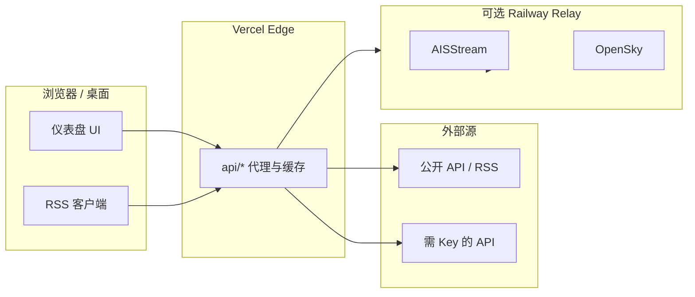

# World Monitor 项目分析：数据源配置与多语言

> 文档版本：基于 **worldmonitor 2.5.23**  
> 生成说明：项目概览、数据源配置方法、数据来源清单、中英多语言实现路径

---

## 目录

- [一、项目概览](#一项目概览)
  - [Windows 本地开发（无需 vercel dev）](#windows-本地开发无需-vercel-dev)
- [二、数据源配置](#二数据源配置)
  - [设计原则](#设计原则)
  - [配置步骤（Web 自托管）](#配置步骤web-自托管)
  - [按功能分组的密钥](#按功能分组的密钥)
  - [桌面端配置](#桌面端配置)
- [三、数据来源总览](#三数据来源总览)
  - [无需 API Key](#1-无需-api-key公开或-unofficial)
  - [需要 API Key](#2-需要-api-key免费档通常够用)
  - [需自建 Relay](#3-需自建-relay非第三方-saas)
  - [数据流示意](#4-数据流示意)
- [四、多语言（中文 + 英文）](#四多语言中文--英文)
  - [现状](#现状中英已接入)
  - [维护流程](#实现维护中英的推荐流程)
  - [界面 vs 新闻内容](#界面语言-vs-新闻内容两层)
  - [待办清单](#若要先做好中英的具体待办)
- [五、参考文档](#五参考文档)
- [六、小结](#六小结)

---

## 一、项目概览

**World Monitor** 是一个实时全球态势感知仪表盘：聚合 100+ RSS 新闻源、3D/2D 地图（40+ 可切换图层）、AI 简报、市场/冲突/基础设施等多维数据。

| 维度 | 说明 |
|------|------|
| 前端 | Vite + TypeScript，MapLibre + deck.gl |
| 后端 | 60+ Vercel Edge Functions（`api/`），Proto 定义约 20 个服务 |
| 桌面 | Tauri（密钥存系统钥匙串，非明文文件） |
| 变体 | `VITE_VARIANT`：`full` / `tech` / `finance` / `happy` |
| 主文档 | `docs/DOCUMENTATION.md`、`docs/Docs_To_Review/EXTERNAL_APIS.md` |

### 本地运行注意

在 **Windows** 上 `vercel dev` 常因未安装 CLI、Edge Runtime 模拟不稳定或路径问题而无法使用。**推荐改用下方「Windows 本地开发」方案**，不必强依赖 Vercel CLI。

通用步骤：

```powershell
cd d:\curProject\h2x\worldmonitor-2.5.23
copy .env.example .env.local   # 按需填写密钥
npm run dev                    # 见下方 Windows 说明
```

打开 [http://localhost:3000](http://localhost:3000)

### Windows 本地开发（无需 vercel dev）

本项目在 **Vite 开发服务器**（`vite.config.ts`）内已内置大量 API 能力，在 Windows 上可直接：

```powershell
npm install
npm run dev
```

`npm run dev` 在端口 **3000** 启动，并包含（节选）：

| 能力 | 实现方式 |
|------|----------|
| RSS 新闻代理 | `rss-proxy` 中间件（`/api/rss-proxy`） |
| Sebuf RPC（17 个领域服务） | `sebuf-api` 插件（`/api/{domain}/v1/*`） |
| 地震、GDELT、FAA、OpenSky 等 | Vite `server.proxy` 直连上游 |
| Polymarket、YouTube live 等 | 专用 Vite 插件 |

将 API Key 写在 **`.env.local`** 中即可被 Vite 读取（如 `FRED_API_KEY` 用于 `/api/fred-data` 代理）。

#### 方案 A：仅 Web 开发（推荐，最简单）

```powershell
npm run dev
# 变体：npm run dev:tech / npm run dev:finance
```

未在本地实现的少数 **旧版** `api/*.js` Edge 路由可能返回 404，一般不影响新闻与大部分面板。

#### 方案 B：混合使用线上 API（补全本地缺失接口）

在 `.env.local` 增加（仅允许 `*.worldmonitor.app` 或 `localhost`）：

```env
VITE_WS_API_URL=https://api.worldmonitor.app
```

前端会把部分 `/api/.../v1/`、`rss-proxy` 等请求转发到线上 API；本地没有的接口自动回退到 `localhost:3000`（见 `src/services/runtime.ts` 的 `installWebApiRedirect`）。

#### 方案 C：桌面版（完整本地 API，不经过 Vercel）

需安装 [Rust](https://rustup.rs/) 与 Tauri 依赖后：

```powershell
npm run desktop:dev
```

Tauri 会启动 Node **sidecar**（`src-tauri/sidecar/local-api-server.mjs`，默认 `http://127.0.0.1:46123`），在系统钥匙串中管理密钥，行为接近生产桌面版。

#### 方案 D：单独运行 Sidecar + 浏览器（高级）

终端 1（在项目根目录，需先把 `.env.local` 中的变量导入当前 PowerShell 会话，或使用 [dotenv-cli](https://www.npmjs.com/package/dotenv-cli)）：

```powershell
$env:LOCAL_API_RESOURCE_DIR = (Get-Location).Path
$env:LOCAL_API_CLOUD_FALLBACK = "true"   # 可选：本地无 handler 时回退线上
node src-tauri/sidecar/local-api-server.mjs
```

终端 2：`npm run dev`。若要让浏览器走 sidecar，需使用桌面运行时或自行配置代理（默认 Web 模式请求同源 `/api`，由 Vite 处理）。

#### 方案 E：部署到 Vercel 后远程开发 UI

```powershell
npx vercel          # 首次链接项目并部署
```

在浏览器打开部署 URL，在 Vercel 控制台配置环境变量。适合不想在本地跑任何 API 的情况。

#### 若仍想尝试 vercel dev

```powershell
npm i -g vercel
# 或单次：npx vercel dev
vercel login
vercel link
vercel dev
```

常见失败原因：未全局安装 CLI、未 `vercel link`、防火墙/代理、Edge 模拟与 Windows 路径兼容性。失败时改用 **方案 A～C** 即可。

#### Windows 脚本注意

部分 `package.json` 脚本使用 `cross-env`（如 `dev:tech`），已兼容 Windows。若自行写 `VITE_VARIANT=full vite` 这类 **Unix 风格** 环境变量前缀，在 PowerShell 中会**静默失效**；应使用 `npm run dev:tech` 或 `cross-env`。

---

## 二、数据源配置

### 设计原则

- **所有 API 密钥均为可选**；未配置时，对应面板/地图图层会隐藏或降级显示。
- **核心能力无需配置**：新闻 RSS、地震、部分市场（Yahoo 等）等仍可用。
- **Web**：`.env.local` → 生产环境在 Vercel 控制台配置同名变量。
- **桌面**：在设置面板填写密钥，由 Tauri 写入 OS Keychain（见 `docs/DESKTOP_CONFIGURATION.md`）。

### 配置步骤（Web 自托管）

1. 复制环境变量模板：`cp .env.example .env.local`
2. 按功能块填写密钥（`.env.example` 内含说明与注册链接）
3. **Windows**：使用 `npm run dev`（见上文）；**macOS/Linux** 可选 `vercel dev` 以模拟全部 Edge 函数
4. 若需船舶/飞机实时跟踪，另部署 **AIS Relay**（如 Railway），并配置 `WS_RELAY_URL` / `VITE_WS_RELAY_URL`

### 按功能分组的密钥

| 分组 | 环境变量 | 作用 | 获取方式 |
|------|----------|------|----------|
| **AI 摘要** | `GROQ_API_KEY`、`OPENROUTER_API_KEY` | World Brief、国家情报简报等 | [Groq](https://console.groq.com/) / [OpenRouter](https://openrouter.ai/) 免费档 |
| **本地 AI** | `OLLAMA_API_URL`、`OLLAMA_MODEL` | 桌面/本地 LLM，数据不出本机 | 本机 Ollama / LM Studio |
| **跨用户缓存** | `UPSTASH_REDIS_REST_URL`、`UPSTASH_REDIS_REST_TOKEN` | AI 去重、风险分等缓存 | [Upstash](https://upstash.com/) 免费档 |
| **股票行情** | `FINNHUB_API_KEY` | 主行情源（缺失时偏 Yahoo） | [finnhub.io](https://finnhub.io/) |
| **宏观经济** | `FRED_API_KEY` | 美联储指标、宏观雷达 | [FRED API](https://fred.stlouisfed.org/docs/api/api_key.html) |
| **能源数据** | `EIA_API_KEY` | 油价、产量、库存 | [EIA Open Data](https://www.eia.gov/opendata/) |
| **冲突与抗议** | `ACLED_ACCESS_TOKEN`（常配 `ACLED_EMAIL`） | ACLED 武装冲突/抗议 | [ACLED](https://acleddata.com/) 研究者账号 |
| **互联网中断** | `CLOUDFLARE_API_TOKEN` | Cloudflare Radar outage | Cloudflare 账号 + Radar 权限 |
| **卫星山火** | `NASA_FIRMS_API_KEY` | VIIRS 热点 | [NASA FIRMS](https://firms.modaps.eosdis.nasa.gov/) |
| **飞机增强** | `WINGBITS_API_KEY` | ADS-B  enrich（商业） | [wingbits.com](https://wingbits.com/) |
| **网络威胁** | `ABUSEIPDB_API_KEY`、`URLHAUS_AUTH_KEY`、`OTX_API_KEY` 等 | 威胁情报聚合 | 各平台免费档 |
| **Relay 中继** | `WS_RELAY_URL`、`AISSTREAM_API_KEY`、`OPENSKY_CLIENT_ID`/`OPENSKY_CLIENT_SECRET`、`RELAY_SHARED_SECRET` | AIS 船舶 + OpenSky + RSS 代理 + Telegram OSINT | 自托管 `scripts/ais-relay.cjs` |
| **Telegram OSINT** | `TELEGRAM_API_ID`、`TELEGRAM_API_HASH`、`TELEGRAM_SESSION` | Relay 侧 MTProto 采集 | [my.telegram.org](https://my.telegram.org/apps) |
| **站点/UI** | `VITE_VARIANT`、`VITE_MAP_INTERACTION_MODE`（`flat`/`3d`）、`VITE_WS_API_URL` | 产品变体、地图模式、API 基址 | 无密钥 |
| **桌面云回退** | `WORLDMONITOR_VALID_KEYS`（服务端）/ 桌面 `WORLDMONITOR_API_KEY` | 桌面访问托管 API | 自生成 |
| **用户注册** | `CONVEX_URL` | 邮件注册存储（可选） | [Convex](https://dashboard.convex.dev/) |
| **可观测性** | `VITE_SENTRY_DSN` | 前端错误上报（可选） | Sentry |

`.env.example` 中还包含：`VITE_SENTRY_DSN`、`ALLOW_UNAUTHENTICATED_RELAY`、`TELEGRAM_CHANNEL_SET` 等 Relay 与部署相关项，部署前请通读该文件。

### 桌面端配置

桌面运行时通过 `src/services/runtime-config.ts` 中的 **功能开关**（`RUNTIME_FEATURES`）与密钥绑定，例如：

| 功能 ID | 所需密钥（示例） | 缺失时行为 |
|---------|------------------|------------|
| `aiGroq` | `GROQ_API_KEY` | 回退 OpenRouter → 浏览器本地模型 |
| `finnhubMarkets` | `FINNHUB_API_KEY` | 行情为空或降级 |
| `acledConflicts` | `ACLED_ACCESS_TOKEN` | 冲突层无数据 |
| `aisRelay` | `WS_RELAY_URL` / `VITE_WS_RELAY_URL` | 船舶跟踪关闭 |
| `nasaFirms` | `NASA_FIRMS_API_KEY` | 山火图层无数据 |

完整密钥列表见 `docs/DESKTOP_CONFIGURATION.md`（Rust 侧支持约 22 个 `SUPPORTED_SECRET_KEYS`）。

---

## 三、数据来源总览

依据 `docs/Docs_To_Review/EXTERNAL_APIS.md`，项目集成约 **38 个外部 API** + **约 150 个 RSS 域名**。

### 1. 无需 API Key（公开或 unofficial）

| 类别 | 数据来源 |
|------|----------|
| 新闻 | 100+ RSS/Atom（经 `/api/rss-proxy` 等代理） |
| 地缘/事件 | UCDP、GDELT Geo/Doc、NGA 海事警告 |
| 自然灾害 | USGS 地震、NASA EONET、GDACS、Open-Meteo（Copernicus ERA5） |
| 市场 | Yahoo Finance（非官方端点）、CoinGecko、Polymarket、alternative.me Fear&Greed、blockchain.info |
| 航空 | OpenSky Network（匿名限额紧，生产建议 Relay + OAuth） |
| 网络威胁 | Feodo Tracker、URLhaus、C2IntelFeeds、AlienVault OTX（部分源无需 Key） |
| 人道/人口 | UNHCR、WorldPop、World Bank、HDX HAPI（可选 `HDX_APP_IDENTIFIER`） |
| 基础设施/其他 | FAA 机场状态、USASpending.gov、PizzINT 等 |
| 研究/社区 | Hacker News、ArXiv、GitHub（`GITHUB_TOKEN` 可选） |

`.env.example` 中标注的纯公开源还包括：**UCDP、UNHCR、Open-Meteo、WorldPop**（无需认证）。

### 2. 需要 API Key（免费档通常够用）

| API | 环境变量 | 说明 |
|-----|----------|------|
| ACLED | `ACLED_ACCESS_TOKEN`、`ACLED_EMAIL` | 冲突与抗议（研究者免费） |
| Finnhub | `FINNHUB_API_KEY` | 股票/ETF 主源 |
| FRED | `FRED_API_KEY` | 美联储经济数据 |
| EIA | `EIA_API_KEY` | 美国能源信息署 |
| NASA FIRMS | `NASA_FIRMS_API_KEY` | 卫星火点 |
| Groq / OpenRouter | `GROQ_API_KEY`、`OPENROUTER_API_KEY` | AI 摘要 |
| Cloudflare Radar | `CLOUDFLARE_API_TOKEN` | 互联网中断（需 Radar 权限） |
| AbuseIPDB | `ABUSEIPDB_API_KEY` | IP 威胁信誉 |
| AISStream | `AISSTREAM_API_KEY` | 船舶 AIS（经 Relay） |
| Wingbits | `WINGBITS_API_KEY` | 飞机数据增强（**商业**） |
| AviationStack / ICAO | `AVIATIONSTACK_API`、`ICAO_API_KEY` | 运行时配置中的航空扩展 |

文档中还提到可选：`GITHUB_TOKEN`、`HDX_APP_IDENTIFIER`、`WTO_API_KEY` 等。

### 3. 需自建 Relay（非第三方 SaaS）

| 能力 | 组件 | 关键变量 |
|------|------|----------|
| 实时船舶 AIS | `scripts/ais-relay.cjs` + AISStream | `AISSTREAM_API_KEY`、`WS_RELAY_URL` |
| 军用/民航 ADS-B 高配额 | Relay 上的 OpenSky OAuth | `OPENSKY_CLIENT_ID`、`OPENSKY_CLIENT_SECRET` |
| Telegram OSINT | Relay MTProto 轮询 | `TELEGRAM_*` 系列 |
| Vercel ↔ Relay 鉴权 | 共享密钥 | `RELAY_SHARED_SECRET`、`RELAY_AUTH_HEADER` |

客户端可选：`VITE_WS_RELAY_URL`（`wss://`，本地/开发回退）。

### 4. 数据流示意



### 降级策略（摘要）

未配置或上游失败时，各模块采用不同策略：返回空数组、CDN/Redis 陈旧缓存、`unavailable` 标志、或 AI 多级回退（Ollama → Groq → OpenRouter → 浏览器 T5）。详见 `EXTERNAL_APIS.md` 第 5 节「Degradation Matrix」。

---

## 四、多语言（中文 + 英文）

### 现状：中英已接入

项目已使用 **i18next**（`src/services/i18n.ts`）：

| 项 | 说明 |
|----|------|
| 语言包路径 | `src/locales/en.json`（主包、打包进 bundle）、`src/locales/zh.json`（懒加载） |
| 支持语言码 | `en`、`zh` 等 19 种；中文在设置中为「中文」`code: 'zh'` |
| 初始化 | `src/App.ts` → `initI18n()` |
| 检测顺序 | `localStorage` → 浏览器 `navigator.language` |
| 切换方式 | `src/components/UnifiedSettings.ts` → `changeLanguage()` → **整页 reload** |
| UI 用法 | 组件通过 `t('panels.xxx')` 等键取值 |
| 中文 HTML | `lang="zh-CN"`，`dir` 非 RTL（阿拉伯语 `ar` 为 RTL） |

**翻译键覆盖率（脚本统计）：**

- `en.json`：1672 条叶子键  
- `zh.json`：1670 条  
- **缺失 2 条**（需在 `zh.json` 补全）：
  - `components.map.hideMap`
  - `components.map.showMap`

### 实现/维护中英的推荐流程

| 步骤 | 操作 |
|------|------|
| 1 | 新增 UI 文案时先写入 `en.json`，保持嵌套 key 结构与现有文件一致 |
| 2 | 同步更新 `zh.json`（可用 Node 脚本对比 `en`/`zh` 叶子键差异） |
| 3 | 组件内使用 `import { t } from '@/services/i18n'`，避免硬编码英文 |
| 4 | 用户在 **设置 → 语言** 选择 English / 中文，或依赖浏览器自动检测 |
| 5 | 日期/数字格式使用 `getLocale()`（`zh` → `zh-CN`） |

若产品仅需中英两种语言，可修改 `SUPPORTED_LANGUAGES` 与 `LANGUAGES` 数组，从设置 UI 隐藏其他语言；`locales/*.json` 文件可保留以备将来启用。

### 界面语言 vs 新闻内容（两层）

| 层级 | 机制 | 说明 |
|------|------|------|
| **界面** | `zh.json` + `t()` | 面板标题、按钮、提示、地图图例等 |
| **新闻源启用** | `feeds.ts` 中 `lang: 'zh'` + `getLocaleBoostedSources()` | 用户语言非英语时，**首次**自动启用带 `lang: 'zh'` 的源（如 MIIT、MOFCOM Google RSS），不覆盖用户手动设置 |
| **多 URL 源** | `url: { en: '...', zh: '...', ... }` | `rss.ts` 按 `getCurrentLanguage()` 选择 URL，无对应语言则回退 `en` |

`rss.ts` 中的 URL 选择逻辑：

```typescript
let url = typeof feed.url === 'string' ? feed.url : feed.url['en'];
if (typeof feed.url !== 'string') {
  url = feed.url[currentLang] || feed.url['en'] || Object.values(feed.url)[0] || '';
}
```

**新闻正文**不会随界面语言自动全文翻译。官方建议见 `docs/Docs_To_Review/NEWS_TRANSLATION_ANALYSIS.md`：

1. **推荐**：扩充 `lang: 'zh'` 或 `url.zh` 的中文 RSS（零 API 成本、质量最好）  
2. **可选**：LLM「摘要并翻译」（需 `GROQ_API_KEY` 等，与现有摘要链路结合）  
3. **不推荐**：启动时批量翻译数百条标题（成本与延迟过高）

### 若要先做好中英的具体待办

- [ ] 在 `zh.json` 补全 `components.map.hideMap` / `components.map.showMap`  
- [ ] 新功能开发时审计硬编码英文字符串  
- [ ] 在 `src/config/feeds.ts` 增加更多 `lang: 'zh'` 或 `url.zh` 源（注意 RSS 可访问性与 `scripts/validate-rss-feeds.mjs`）  
- [ ] （可选）将 `changeLanguage` 从整页 reload 改为事件驱动重渲染  
- [ ] （可选）AI 简报 prompt 传入 `getCurrentLanguage()`，使输出语言与 UI 一致  

---

## 五、参考文档

| 文档 | 路径 |
|------|------|
| 环境变量模板 | `.env.example` |
| 完整产品文档 | `docs/DOCUMENTATION.md` |
| 外部 API 目录 | `docs/Docs_To_Review/EXTERNAL_APIS.md` |
| 桌面密钥与功能 | `docs/DESKTOP_CONFIGURATION.md` |
| Relay 部署参数 | `docs/RELAY_PARAMETERS.md` |
| API Key 部署说明 | `docs/API_KEY_DEPLOYMENT.md` |
| 新闻翻译策略 | `docs/Docs_To_Review/NEWS_TRANSLATION_ANALYSIS.md` |
| i18n 服务实现 | `src/services/i18n.ts` |
| RSS 与语言 | `src/services/rss.ts`、`src/config/feeds.ts` |
| 运行时功能开关 | `src/services/runtime-config.ts` |

---

## 六、小结

| 问题 | 结论 |
|------|------|
| 项目是什么？ | 全球态势仪表盘：新闻 + 地图多图层 + AI + 市场/冲突/基础设施；Vercel API + 可选 Tauri 桌面 |
| 如何配置数据源？ | 复制 `.env.example` → `.env.local`，按功能填 Key；**Windows 用 `npm run dev` 或 `desktop:dev`**；船舶/飞机需自建 Relay |
| 数据来源有哪些？ | 38+ 外部 API + 150+ RSS；多数公开免费；增强能力依赖 Key 与 Relay |
| 中英多语言怎么做？ | **已实现** i18next + `en`/`zh` 语言包；维护 `zh.json` + 中文 RSS；新闻正文不默认机翻 |

---

*本文档为项目分析备忘，随代码版本更新时请对照 `.env.example` 与 `EXTERNAL_APIS.md` 复核。*
